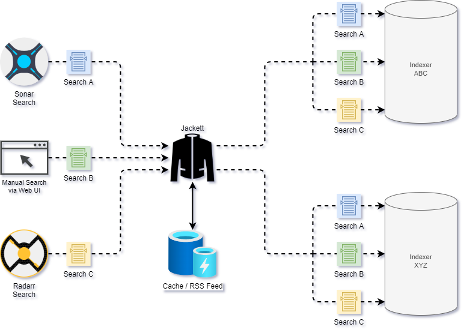

# Jackett

Jackett acts as a Cache / RSS Feed / Search Engine between PVR software and any configured Torrent Trackers / Torznab Indexers.

## High-level overview



---

## Expected Disk Usage

Jackett uses very minimal disk space, as it's more of a utility / cache than full-blown application like Sonarr, Radarr, etc. The templates included in this repository default to providing Jackett with **128MiB** of space. This should be more than enough, considering defualt OOTB with 60 Indexers configured, uses around 350Kib.

## Deploy and Configure Jackett via Script

For those seeking ultimate convenience, simply run the below script:

```shell
sudo ./scripts/bootstrap-jackett.sh
```

## Deploy and Configure Jackett Manually

For those wanting to understand everything step-by-step, or are having problems with the bash script, here's the low-down on what's happenin'...

```shell
helm install jackett k8s-at-home/jackett -n jollyroger -f helm/jackett.yml

---

JACKETT_POD_NAME=$(kubectl -n jollyroger get pods | grep jackett | awk '{print $1}') \
&& kubectl -n jollyroger exec $JACKETT_POD_NAME -- sed -i 's/\"BasePathOverride\": null/\"BasePathOverride\": \"\/jackett\"/g' /config/Jackett/ServerConfig.json \
&& kubectl -n jollyroger rollout restart deployment/jackett
```

---

## How do I use this thing?

### Privacy Warning

Even though all traffic generated by Jackett is being routed over the Wireguard PIA VPN...please be aware that clicking on ANY Tracker's name in the Jackett UI _WILL_ launch a browser window opened up to that tracker's site. Be careful where you're clicking in the UI. Not really the end of the world if you do click, but just be aware you could leak locally in your browser.

### Terms you should know

| Term                 | Description                                                                                                                                                 |
|----------------------|-------------------------------------------------------------------------------------------------------------------------------------------------------------|
| Torrent              | Contains metadata about a file, or group of files, and any Trackers that might have additional information about where to download the files.               |
| Tracker (Indexer)    | A Tracker is a service that keeps track of who has what bits-and-pieces of a Torrent available across all the peers that are participating in sharing them. |
| Leech(er)            | Someone that is downloading the files from a torrent.                                                                                                       |
| Seed(er)             | Someone that is helping share the files from a torrent.                                                                                                     |
| Torznab Capabilities | ... |

### Login

TODO: Determine what host/ip to have people use here once SWAG / Ingress are configured properly.
TODO: Figure out if preset admin password or blanked-out, not sure which road to take yet
* Navigate to `https://<ip here>/jackett`
* Enter a password of: `<password here>` and click Login

### Understanding what you're staring at

#### API Key

At the very top of the page is an API Key. This field is useful to configure other services that need to communicate with Jackett, such as Sonarr or Organizr.

#### Add Indexer dialog

If you click the Add indexer button at the top of the page, a dialog will popup with an absolute crapload of Torrent Indexers that Jackett supports communicating with. For the purposes of this documentation, we're going to assume that there are no Private or Semi-Private (paid / invite-only) trackers being used.

Let's try filtering down to **Public** trackers that are in the **English** language and have **TV** results:

* Change the **Type** filter drop-down from _Show all_ to `Public`
* Change the **Language** filter drop-down from _Show all_ to `en-US`
* Change the **Categories** filter drop-down from _Show all_ to `TV`

Once you've narrowed down the list, you can then add any of the trackers by clicking the green + button on the right of the listing.

#### Manual Search Dialog


#### More...

* `<explain Cached Searches dialog>`
* `<explain Testing functionality>`
* `<explain Configured Indexers section>`
* View logs button - Useful to see what Jackett has been up to, and whether or not there have been any errors ocurring.
* At the very bottom of the page are configuration options for Jackett. Here you can change things like the login password, cache size/ttl, and more.
  * Admin password: Feel free to change this to whatever you like (Note: you CAN reset this out if you fudge up)
  * Base path override: This is used for reverse proxy support (like us, sitting behind nginx). Only screw with this if you're playing around with Ingress rules and what-not.
  * Base URL override: `<need to look this up, never used it>`
  * Server port: The port that the Jackett API and UI run on.
  * Blackhole directory: `<I need to test this to make sure it does what I think it does>`
  * Proxy type: No need to touch this, thanks to Pod Gateway and PIA Wireguard VPN
  * Proxy URL: No need to touch this, thanks to Pod Gateway and PIA Wireguard VPN
  * Proxy port: No need to touch this, thanks to Pod Gateway and PIA Wireguard VPN
  * Proxy username: No need to touch this, thanks to Pod Gateway and PIA Wireguard VPN
  * Proxy password: No need to touch this, thanks to Pod Gateway and PIA Wireguard VPN
  * External access: `<I need to look this up>`
  * Disable auto update: Leave un-checked. The auto-update feature is removed from the K8s at Home image anyway, so it won't work.
  * Update to pre-release: Leave un-checked. Who wants an unstable environment? Not I.
  * Enhanced logging: Leave un-checked, unless you are debugging Jackett because it's not behaving correctly.
  * Cache enabled: Unless you're crazy-low on RAM, leave this bad larry checked-off.
  * Cache TTL: The 1-hour default should be sufficient.
  * Cache max results per indexer: This really depends on how busy your environment is and whether you have some extra RAM to spare.
  * FlareSolverr API URL: If you chose to run a FlareSolverr container in this stack, then this should be set to `http://<FlareSolverr Host info>:8191`
  * FlareSolverr Max Timeout: Leave at default of 55-seconds.
  * OMDB API Key: Don't worry about this, was added to fill a gap for CouchPotato users.
  * OMDB API Url: Don't worry about this, was added to fill a gap for CouchPotato users.

## Troubleshooting

### Login password isn't working anymore

If your login password was working before, and you're definitely sure you didn't change it, then chances are you have a SNAFU with the cookie(s) Jackett sets. Try opening up a private browsing window, and give it a go there.

If private browsing didn't fix your login issue, then another option on the table is to just blank-out the login password and set it again.

`<insert steps for blanking out Jackett password>`

## FAQ

### Why Jackett and not Prowlarr?

Prowlarr is still being very actively developed, and at the time of this writing has many major issues that Jackett does not. In favor of "something that's stable", I still use Jackett in my stack. I will most likely switch to Prowlarr down the road, but I'm still not satisfied with it yet.

### How do I cycle my API Key?

If you feel like your API Key may have been compromised, or you just want to rotate it as part of best practices, this is a quick and simple way...

```bash
JACKETT_POD_NAME=$(kubectl -n sandbox get pods | grep jackett | awk '{print $1}') \
&& kubectl -n sandbox exec $JACKETT_POD_NAME -- sed -i '/APIKey/c\  \"APIKey\": null,' /config/Jackett/ServerConfig.json \
&& kubectl -n sandbox rollout restart deployment/jackett
```